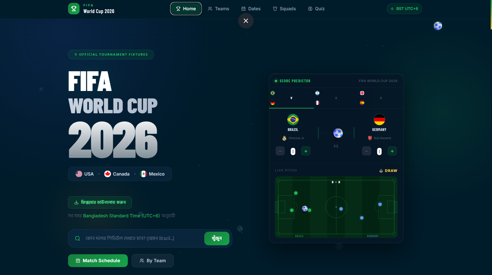

# 🏆 FIFA World Cup 2026 — Fixture Tracker

A modern, fully responsive FIFA World Cup 2026 fixture website built with **React + Vite + Tailwind CSS**.

All match times are displayed in **Bangladesh Standard Time (BST / UTC+6)**.

---

## 📸 Screenshot



---

## ✨ Features

- **Home Page** – Hero section with countdown, stats, quick navigation, host venues
- **Score Predictor Widget** – Interactive match score predictor with animated football pitch
- **World Cup Winner Predictor** – Pick your champion from all 48 teams
- **Fixtures by Team** – Select any of the 48 teams, see their full schedule
- **Fixtures by Date** – Calendar date picker, browse all matches by day
- **Team Squads** – Full 26-man squads with player positions and clubs
- **World Cup Quiz** – 20-question quiz with timers, streaks & explanations
- **📥 Fixture PDF Download** – Download the full BST fixture sheet as PDF
- **Upcoming Match Marquee** – Live scrolling ticker of upcoming matches
- **Animated Countdown** – Flip-card countdown to tournament start
- Dark mode glassmorphism design with FIFA green theme
- Fully responsive: mobile, tablet, desktop
- Team flags via country-flag-icons (SVG)
- Hind Siliguri + Barlow Condensed Google Fonts throughout

---

## 🚀 Quick Start

### 1. Install dependencies

```bash
npm install
```

### 2. Start development server

```bash
npm run dev
```

Then open: **http://localhost:5173**

### 3. Build for production

```bash
npm run build
```

---

## 🗂 Project Structure

```
src/
├── components/
│   ├── Navbar.jsx         # Sticky responsive navbar
│   ├── Footer.jsx         # Footer with links & author credit
│   ├── MatchCard.jsx      # Individual match card
│   ├── FlagIcon.jsx       # Country flag renderer
│   ├── TeamSelector.jsx   # Searchable team dropdown
│   ├── DateSelector.jsx   # Calendar-style date picker
│   ├── SearchBar.jsx      # Reusable search input
│   └── ScrollToTop.jsx    # Floating scroll button
│
├── pages/
│   ├── Home.jsx           # Landing page (hero, predictor, groups)
│   ├── FixturesByTeam.jsx # Team fixture browser
│   ├── FixturesByDate.jsx # Date fixture browser
│   ├── Squads.jsx         # Team squads viewer
│   └── Quiz.jsx           # World Cup quiz
│
├── data/
│   └── fixtures.json      # All match fixtures (BST times)
│
├── utils/
│   ├── countryUtils.js    # ISO codes, team list helpers
│   ├── dateUtils.js       # dayjs formatting helpers
│   └── clubLogoMap.js     # Club logo mapping utility
│
├── routes/
│   └── AppRoutes.jsx      # React Router config
│
├── App.jsx
├── main.jsx
└── index.css              # Tailwind + custom CSS

public/
└── fifa_2026_fixture_BST.pdf   # Downloadable fixture PDF (BST)
```

---

## 🌍 Timezone Note

All times in `fixtures.json` are pre-converted to **Bangladesh Standard Time (BST = UTC+6)**.

No runtime conversion is performed — times are stored and displayed as-is.

---

## 🛠 Tech Stack

| Tool               | Version |
| ------------------ | ------- |
| React              | 18      |
| Vite               | 5       |
| Tailwind CSS       | 3       |
| React Router       | 6       |
| Day.js             | 1.11    |
| country-flag-icons | 1.5     |
| Lucide React       | 0.363   |

---

## 📋 Groups

| Group | Teams                                        |
| ----- | -------------------------------------------- |
| A     | Mexico, Poland, South Africa, Cameroon       |
| B     | USA, Honduras, Panama, Uruguay               |
| C     | Germany, Japan, Australia, New Zealand       |
| D     | France, Saudi Arabia, Denmark, Peru          |
| E     | Spain, Venezuela, Portugal, Algeria          |
| F     | Brazil, Serbia, Croatia, Trinidad and Tobago |
| G     | Netherlands, Senegal, South Korea, Nigeria   |
| H     | Argentina, Iran, Morocco, Haiti              |
| I     | England, Egypt, Colombia, Turkey             |
| J     | Belgium, Ukraine, Switzerland, Mali          |
| K     | Ecuador, Costa Rica, Hungary, Côte d'Ivoire  |
| L     | Italy, Cuba, Norway, TBD                     |

---

## 👤 Author

Made with ❤️ by **[Mohammad Hafizur Rahman Sakib](https://hafizsakib.vercel.app/)** 🇧🇩
